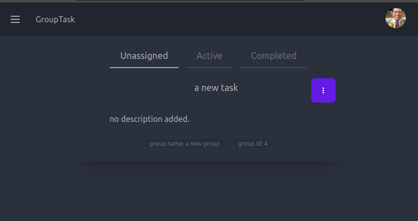
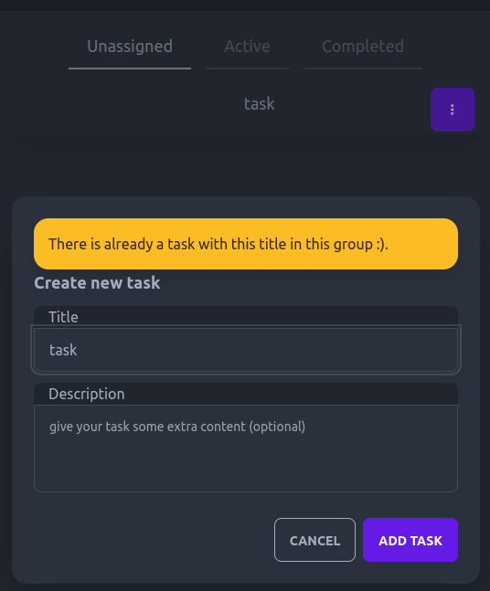

# GroupTask
this is the front end part of the application. [Click Here](https://github.com/4ntm4n/ms-five-api) to read the backend documentation.

## Project outline

> GroupTask is my take on a collaborative taskmanagement application that lets users create groups and add other users of the app to those groups where they can add update complete and delete tasks together. Users can see who is currently working on a task under and "acvive tasks tab" within a group. A user can also view All her active tasks regardless of what group they belong to under the "tasks page" 
> 
> There are no hirarchies or roles in this app, user are instead encourraged to take ownership of uninitiated tasks that are collectively added to the group, rather than being deligated a task from a group leader.
>
> In this first itteration of the application, by design everyone who signs up to the app is available as user to add as a member to a group. So this version of the app would not be suitable to be an app open to the whole internet, but could work great if it was depoyed internally within a companys intranet, where all members of a company could have an account and add eachother to different groups to complete tasks together.

[**Have a look on your own device**](https://grouptask.herokuapp.com/)
> PLEASE NOTE: the initial loading of the app might be extra slow since heroku's free hosting hybernates after inactivity. So if no one has used the app for a while (highly likely), the server has to spin up before it even attempts to load the app.

### **user stories:**

> Typical users are interested in getting some kind of task or project done toghether with collegues or friends.

- **The typical end user wants to:**

  - be able to create a group / project
  - update name and description of group / project
  - enter a detailed group view to add, update, delete tasks to the group
  - be able to see who are members of the group
  - be able to view all tasks that the user owns, regardless of what group they belong to
  - update profile image so that other users can identify her in the app

- **a typical returning user wants to:**
  - be able to sign and continue where she left off.

> anyone on the app can create a group, there are one added function that a group owner has, that a group member does not have, and that is the ability to add and remove members of the group. the group owner.

- **in addition, a user who is a group owner wants to:**

  - have the ability to add users to the group
  - have the ability to remove users from the group
  - have the ability to delete the group

## Approach

- This application is created using **CRA framework** (create react app).
- Navigation is done with the **Router-dom-v6** NPM package
- Authentication is built with a **useContext hook paired with Axios intercepors**
- layout and styling is aided by **TailwindCSS**
- components are initally created with **DaisyUI**
- Frond and backend is depoyed to **Heroku**

### Design Approach
> I began this project with a simplest possible design approach. I drew up some rough sketches of wireframes on paper to get an idea of how I wanted the project to look. Then, I needed to decide on the technologies that would help me translate these drawings into a functional website. I decided to use Tailwind for managing the CSS styles and a component library called DaisyUI that works with Tailwind. DaisyUI was a good fit because it provided ready-to-use components that I could easily customize by adding Tailwind classes. This made it straightforward to turn my initial sketches into working code.

### colors and element design,
> In terms of colors and element design, I decided to use the basic color theme for the initial version of the app (MVP). DaisyUI provides options for customizing the theme, but I found the default theme to be visually appealing. Additionally, the theme automatically adjusts based on the user's browser settings. If the user's browser has dark mode enabled, the app adopts a basic dark mode theme, while it uses the default light mode theme for other browser settings.

> While DaisyUI primarily focuses on providing components, it doesn't offer extensive support for element animations, especially within nested React components. However, since DaisyUI is built on top of Tailwind, it was relatively easy to create custom elements from scratch that seamlessly blended with the rest of the app. For example, I used Tailwind exclusively to design and animate elements such as the member addition card and the task information card.

### Wireframes

**Groups Page and Group Detail Page**

> This is the rough initial idea for the groups list- and detail page.
>
> The groups page is responsible for listing all groups that the user is a member of. One group-card component for each group. as well as the ability to add a new group. 
>
> the group detail page is responsible for showing group information in a sidepanel, such as group members and information about the group. and has a main area wher the tasks for the group is shown. 
> some filter buttons on the top let the user switch between un-initiaded tasks, active tasks and completed tasks.

---

**Event Page and Task Page**

> here is the ideas I had for the task page and "event page". The event page has not made it into this itteration of the front end part of the project, but you can read more about the idea behind it in the backend part of this project. 
> 
>You can also see that the tasks page has an idea for a sidepanel that did not make it into this itteration. The idea with the sidepanel is to give the user access to some predefined filters on his own tasks, and a search button to search for individual tasks. 
>
> The events page should show an event card that takes in information both from recent groups created and recent tasks created, to inform a user of recent activities with groups that the user has been added to or where tasks has been midified. For example " user **X** completed task **Y** in group **Z**". 
>
> The task page is showing all tasks that a user owns, regardless of what group they belong to, so a user quickly can start clearing some tasks they own.

---

**Group- Task- and members search Members cards**

> Here are the ideas I had for the
> - **Group Card**  that shows information about a group
> - **Task Card** that shows information related to a task
> - **members search and members card** lets users search for a member and shows a card for each result
>
> **The Group card** features an image of the owner of the group, an options button if the owner of the group is the current user, a title and description of the group, an avatar list that shows how many members there are to the group and a button that links to that group's detail page.
>
> **The Task Card** features an avatar that shows who is the owner of the task, a task title, and a button with actions that are possible to take on the task depending of if it is unitiated, in progress completed, or already owned by someone else. It also features a dropdown to show the description of the task if the title is clicked.
>
> **The search members component** updates on change to show members that includes the search query in the search box. for each result a member card is shown. If the owner is already in the group a minus button appears, that lets user remove the user from the members of the group. If the user is not a member a plus icon indicates that a user can be added to the group.

---

### Technical Approach

One of the most challenging aspect of this project was to settle on a technical design apporach that could scale with the app and not break as I added more features. Since the front end portion of this app is made with CRA (create react app) and not using a React framwork such as Next.js or Remix.js (which is recommended by the React dev community) There has not been any real best practices to follow in terms of technical apprach. 

I have set up a few patterns that i tried to follow during the buildout of this app to help me have a more unified technical design through out the app:

**the app is devided into pages and components**
> - **pages** 
> > Pages are the top level components that the user is interacting with when navigating on the webste.
> > These are the components that defines the routes in the app. Some routes are restricted to authenticad user and some routes are restricted to un-autherized users and some can be viewd by both.
>
> - **components**
> > The goal of the components are to handle as few responsibilities as possibles. ideally only one. although that has not always been the case. these components collectively build up the different pages and can be shared between diffrent pages and components.  
> 
- **making get requests in the top level components (pages):**
> One design pattern I decided on was to try and make all the get requests on the top level components, and then use callback functions from lower level components to notify when a change is made. This creates a single source of database data, that the lower level components share and update and reduces the amount of requests being sent if a top level component is being re-mounted. 
>
> Apprart from making the code a bit more effective, having a principle like this has made it easier for me to build out the app and track what is happening.

- **making post requests from inside nested components :**
> To separate some functionality from the top level components, patch and post requests are made in the lower level compoents. when a post requst has been completed successfully the top level component is then notified of the change by triggering a callback to the top level component where the get request is made to re-render the updated parts of the page when data on the server is changed.

---

- #### **Creating my own axios interceptors method that scales**

> 
>
>> _Refeer to this flowchart when reading the explanation below._

> The backend of this project is set up so that an access token expires every 5 minutes, and for this application I have created an axios instance that handles updating that refresh token automatically, AND it also makes sure that the refresh endpoint is only called ONCE no matter how many requests are failing across the app when the access token becomes invalid.
>
> this has by far been the most complicated aspect of this project. The problem I faced was that all the requests that was failing created multiple requests inside the axios interceptor to the refresh token endpoint. the more tasks that were created by users, the more requests where being made to the refresh endpoint if a token had expired. This made the app extremely slow, and even crashed as more and more data was being added by users in the app.
>
> **To solve this I came up with a silly metaphore of what was going on**
>
>> I imagined every request as a person that had a key-card (**access-token**) to enter different rooms in a house (**protected endpoints in the database**). each key-card had an expiration time. if the card was expired, everyone rushed into the shed outside the house where they could prolong the expiration time of they key-card (**refresh token endpoint)**. 
>>
>> The problem I had was that if there were a lot of requests (a huge crowd of people) the shed got extremely crowded and everyone suffocated (**the app crashed**). 
>>
>> to solve this, I created a function that acts like a light switch inside the shed, and the first person that gets there toggles the light on, signaling to the other people that a renewal is already in progress. if a renewal is in progress, no one else can enter. Instead they need to wait outside (**refreshSubrscribers array**) until the the first person is done. 
>>
>> Before the first person toggles the light-switch off again, he provision his key from his card to the other people that's waiting outside so that they do not even have to enter. 
>>
>> Now they can all retry to go back in to what ever room in the house they were going to, with a valid key. and only one person had to make the actual refresh that obtained the new valid key.
>
> **a more technical explaination**
>> I have created a boolean variable called "isRefreshing" that is set to false initially. when multiple requests needs to refresh their tokens because they expired, the interceptor will check if isRefreshing is false, if it is it means that this is the first request to reach this part of the code. This request will then set the isRefreshing to true, which notifies that a refresh is in progress. 
>>
>> any following request will create a new request **PROMISE** that creates a callback function that is stored in an array called "refreshSubscribers". 
>>
>> when the first request is done it will  take the response from api/token/refresh which contains the new access token and provide it to each of every callback that is stored in the refreshSubscribers array. 
>>
>> **only then is the promise fulfilled** and the interceptor will return the "retryOriginalRequest" which will indeed retry the original request with the new access token provided by the first request. 
>
> 
> > this is what it looked like in the first attempt of creating this app. every requests that was made after the token was expired, went through the token refresh process, making the app crash and not scale.
>
> 
> > this is what requests looks like after implementing my custom interceptors. regardless of how many requests were made after a token had expired, only one request is sent to refresh token endpoint. It scales even when lots of new data has been added by users inside the app.

---

- **useRef hook instead of useState and change handling for forms:**
> a big part of building a front end part of a full stack application is handling forms that a user fills out to communicate with the serverside logic. In this app I am generally not interested in tracking user input. So instead of using a state that stores the value of the user input I am instead utalizing reacts "useRef hook" to store the value of an input field and then send that input onSubmit(when the form is submitted). Since there are forms for loging in, signing up, creating and updating both tasks and groups This made a positive improvment to the app's performance. 
>
> A part where I wanted to track change was in the "AddGroupMembers" component however. Here I wanted to track the users input to send a request to the server everytime the input changed, and I used the more old-school version of handling input fields where a change event sets a state of the input fields on change and that input fields input is then used to set a search query field in the request that is sent to the server everytime the user enters a letter into the search field.

#### CRUD functionality

- A user can **Create**, **Read** **update** and **Delete** a **group** that he/she owns.
- A user can **Create**, **Read** **update** and **delete** a **task**.
- A user can also **Take ownership **of, and **complete** a task

---  

## Testing

## **Testing User stories**

In this section, we are testing the user stories stated in the outline before this website was created, to check if we have met all user needs. 

- **Typical users wants to:**

  - **Be able to create a group / project**
  
    
    

  - **Update name and description of group / project**
  
    
    

  - **Enter a detailed group view to add, update, delete tasks to the group**
  
    
    > the group detail page concists of a  main area where the tasks are shown 
    > and if the user clicks the group button at the bottom, a sidebar with group information appears.
    
    
    > a user can click add task to add a new task to the group. a new task will have the uninitated status.
    
    > an uninitiaed task has some options available to all group members.

  - **Be able to see who are members of the group**
  
    
    > the sidebar shows which members belongs to the group, indicated by their profile image
    > a member that is not the owner of a group can view members but not edit members.

  - **Be able to view all tasks that the user owns, regardless of what group they belong to**
  
    
    > by navigating to the tasks page a user can see all tasks that he / she owns
    > regardless of what group the task belongs to.

- **Existing users want to:**

  - **Update profile image so that other users can identify her in the app**
  
    
    > a user can easily change proile picture from any page in the app by clicking
    > the profile avatar in the navbar.
- **Site owner wants to:**

  - **Have the ability to add and remove members to the group**
  - 
    
    > a group owner can easily add and remove group members from the same view
    > if the member is already in the group, a minus symbol indicates that the member
    > will  be removed if the card is clicked. If the user is not yet a member, the user will
    > be added if the card is clicked indicated with a plus sign. 
    >> additionally a group owner can search for a member to narrow down the list of users on the app to more eaisly find the user the group owner is looking for.
    > the searchbox tracks changes to the input and fires off a request everytime the search query changes.

  - **Have the ability delete group the user owns**
    
    > a vertical dots button appears on groups the user is an owner of. 
    
    > an option to delete the the group permanently appears.
    > the group and all related tasks to it will be deleted from the server.

- **extra**

  - **Form Validation**
  
    
    > all forms through out the app displays error messages produced by the server side validation, including task add and update form, login and signup form and group forms

  - **custom background image carousel**
    
    > landing page toggles through images that easily can be added to the backgroundImage component.

## Bugs
all the bugs listed here are still in the app due to lack of time to fix them. I have a clear idea of how, it is just a matter of lack of time.
> - **Group card**
>> 
>>  issue: group cards height vary depending on if group owner is current user and depending on lenghth of group description
>>
>> solution: add fixed height that is slighly larger than group card with optionsbutton visible, add scrollable descriptions section 
>
>> - **Multiple groups with same name**
>>  issue: a user can create multiple groups with the same name which is confusing. (this is either a feature or a bug)
>>
>> solution: add backend logic that raise error 403 if user tries to create a group with the same name by adding a "unique togehter field" between group name and user id in the group model. front end logic that handles form feedback will show the message with current setup. (this is also already implemented for tasks but where overseen for groups.)
>
> - **GroupTask logo**
>>  issue: there are currently no custom logotype for this app, and when clicking on it nothing happens.
>>
>> solution: add custom created logotype, then refactor logo into "Link" element that takes user to homepage if user is false, or to groups page if user is true

## Future improvements
I have yet to experience any bugs in the core functionality after manually testing the app. 
Hover, this app is an MVP in many ways and features should be added to both improve the functionality of the app and also improve the user experience in many ways that could and should be added to a future itteration of this app.
 
> - **Adding user feedback**
> > a toast or an alert should be added to notify a user when new groups and tasks are being removed and added. when members of a group is being removed and added etc.
>
> - **Adding user CRUD functionality**
> > a user should ideally be able to update user info, such as password update and reset, and should be able to delete his user account.
> 
> > - **Adding more modals**
> > a user should get ideally get a confirmation question displayed in a modal before destroying a group. 
>
> - **Enhancing signup and login functionality**
> > the backend is partly prepaired to handle single click signup and login with 3rd party authentication services through dj-rest-auth views, but has not been a priority for making this app work in the short timespan I have had to create this appliciation.
>
> - **Event view**
> > the backend is set up to handle an additional view called "events" which is a view that would show recent activities in groups that the user is a member of. To add this feature a new eventpage should be added to the nav menu and a new type of task card that has a different design and show task data in a different way should be added to the components and rendered out for each task displayed on the the EventPage.
>
> - **limit users to a specific company or context on signup**
> > this is not really a front end only issue, but an important improvement that needs to be adressed for this app to run publically on the web is to add some sort of invitaiton system on signup so that not all users are exposed to every person in the app. Alternatively, all users could be accessable by everyone else, but an invite system would have to be added to let users accept or decline invites to a group.
>
> - **ability to hide groups that are not relevant to a user**
> > again, this is more of a backend limitation than a front end, but ther are currently no way of leave or hide a group that you have been added to. functionaloty to be able to leave a group without the group owner doing it for you would arguably be a good idea. Alternatively an extra key could be added to the group object that sets group visibility to true or false so that users could hide groups they do not want to be visible throughout the app. This might acutally be possible to add in the current state of the app with a patch request to the groups model.

## Deployment

- The site front end part of this app was deployed on heroku. The steps to deploy are as follows:
  - change the baseURL inside src/api/AxiosInterceptors.js in the react app
  - add, commit and push latest version of react app to github
  - Log in to heroku and create new app, select region (in my case EU)
  - From the app overview navigate to settings and add buildpack, select heroku/nodejs
  - Navigate deploy and connect to your github account
  - search for the repository containing the react application
  - enable automatic deploy or click deploy branch
  

## Credits

> **React router dom v6**
> https://www.youtube.com/watch?v=Ul3y1LXxzdU&t=1392s
> *web dev simplified showing an overview of react router dom v6*

> **Token based authentication with django and Axios interceptors**
> https://www.youtube.com/watch?v=xjMP0hspNLE&t=5616s
> https://www.youtube.com/watch?v=16-1mTdGBoM
> *Dany Ivy teaching me the basics of axios interceptors and refresh tokens that I ended up taking some ideas from*

> **axios interceptors, request and response interceptor working togehter**
> https://www.youtube.com/watch?v=nI8PYZNFtac
> *Dave gray showing an example of how to integreate both request and response interceptors to work together*
>

**react 18 best hooks and best practices
>**https://courses.webdevsimplified.com/**
> *for example learned to use 'useRef' hook to handle form data instead of handle change on every form field, which speeds up the app, makes code more readable and simplifies implementation greatly.*

**Tailwind CSS**
> https://tailwindcss.com/
> *ailwind was used as a base for handling css classes in my application*

**DaisyUI**
> https://daisyui.com/
> *DaisyUI is a set of pre-made components build with tailwind*
> *Using DaisyUI in my application allowed me to implement basic components quickly, and then tweak and modify them by adding my own style with tailding. Tailwind natively extends DaisyUI which has been very helpful in creating this app in a short timeframe*

> **general learning resources ive used in this project**
> codecademy.com
> freecodecamp.org
> codeInstitute.net

---

### Some final words from the developer

Thank you for taking the time to read through this website documentation.

This project is the front end part of the fifth and final milestone projects in a full stack developer course that I have enrolled through [Code Institute](https://codeinstitute.net).

I have learned a lot through out this course. and I am relatively happy with the outcome of what I have learned so far.
Going forward I will try to stick to more controlled frameworks in react. One of those that are now also recommended by the react dev comunity since CRA is deprecated, such as NextJS or Remix that will help me to enhance development speed and solidify some best practices in developing full stack applications. Working with Create-react-app that does not come with any true stardardisations when building out an application has truly been a challange I am not sure I want to persue anytime soon..

### Additonally
> this is the 2nd attempt at creating this application. Due to the problems I had with the auth method I had to completely rebuild the auth method in the backend and re-do this front end application. Therefor I have not included the sprints in this app. They were connected to the previous build attempt.
> the first trainwreck attempt to create this app can be found here:
> https://github.com/4ntm4n/ms5-front-end/
> 
> the userStories and sprints I originally built the app from are connected to that project and can be found here:
> these are N/A in this version of the app, since the last month has been one long painful sprint to try and get this app sent in.
> https://github.com/users/4ntm4n/projects/6/views/1

> GroupTask - a study in Advanced front end
>
> By Anton Askling 2023

