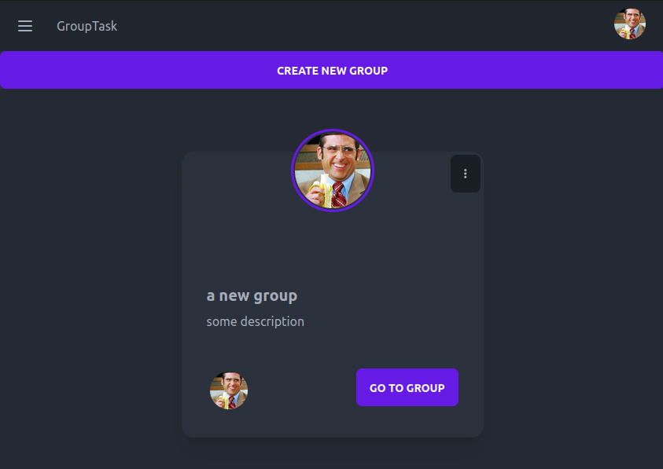

# FlexGrid Yoga

## Project outline

> GroupTask is my take on a collaborative taskmanagement application that lets users create groups and add other users of the app to those groups where they can add update complete and delete tasks together. Users can see who is currently working on a task under and "acvive tasks tab" within a group. A user can also view All her active tasks regardless of what group they belong to under the "tasks page" 
> 
> There are no hirarchies or roles in this app, user are instead encourraged to take ownership of uninitiated tasks that are collectively added to the group, rather than being deligated a task from a group leader.

[**Have a look on your own device**](https://grouptask.herokuapp.com/)

### **user stories:**

> Typical users are interested in getting some kind of task or project done toghether with collegues or friends.

- **The typical end user wants to:**

  - be able to create a group / project
  - update name and description of group / project
  - enter a detailed group view to add, update, delete tasks to the group
  - be able to see who are members of the group
  - be able to view all tasks that the user owns, regardless of what group they belong to
  - update profile image so that other users can identify her in the app

- **a typical returning user wants to:**
  - be able to sign and continue where she left off.

> anyone on the app can create a group, there are one added function that a group owner has, that a group member does not have, and that is the ability to add and remove members of the group. the group owner.

- **in addition, a user who is a group owner wants to:**

  - have the ability to add users to the group
  - have the ability to remove users from the group
  - have the ability to delete the group

## Approach

### Design Approach
> I began this project with a simple approach. I drew up some rough sketches of wireframes on paper to get an idea of how I wanted the project to look. Then, I needed to decide on the technologies that would help me translate these drawings into a functional website. I decided to use Tailwind for managing the CSS styles and a component library called DaisyUI that works with Tailwind. DaisyUI was a good fit because it provided ready-to-use components that I could easily customize by adding Tailwind classes. This made it straightforward to turn my initial sketches into working code.

### colors and element design,
> In terms of colors and element design, I decided to use the basic color theme for the initial version of the app (MVP). DaisyUI provides options for customizing the theme, but I found the default theme to be visually appealing. Additionally, the theme automatically adjusts based on the user's browser settings. If the user's browser has dark mode enabled, the app adopts a basic dark mode theme, while it uses the default light mode theme for other browser settings.

> While DaisyUI primarily focuses on providing components, it doesn't offer extensive support for element animations, especially within nested React components. However, since DaisyUI is built on top of Tailwind, it was relatively easy to create custom elements from scratch that seamlessly blended with the rest of the app. For example, I used Tailwind exclusively to design and animate elements such as the member addition card and the task information card.

### Wireframes

These wireframes are created using Adobe Illustrator.

---

### Technical Approach

One of the most challenging aspect of this project was to settle on a technical design apporach that could scale with the app and not break as I added more features. Since the front end portion of this app is made with CRA (create react app) and not using a React framwork such as Next.js or Remix.js (which is recommended by the React dev community) There has not been any real best practices to follow in terms of technical apprach. 

I have set up a few patterns that i tried to follow during the buildout of this app to help me have a more unified technical design through out the app:

**the app is devided into pages and components**
> - **pages** 
> > Pages are the top level components that the user is interacting with when navigating on the webste.
> > These are the components that defines the routes in the app. Some routes are restricted to authenticad user and some routes are restricted to un-autherized users and some can be viewd by both.
>
> - **components**
> > The goal of the components are to handle as few responsibilities as possibles. ideally only one. although that has not always been the case. these components collectively build up the different pages and can be shared between diffrent pages and components.  
> 
- **making get requests in the top level components (pages):**
> One design pattern I decided on was to try and make all the get requests on the top level components, and then use callback functions from lower level components to notify when a change is made. This creates a single source of database data, that the lower level components share and update and reduces the amount of requests being sent if a top level component is being re-mounted. 
>
> Apprart from making the code a bit more effective, having a principle like this has made it easier for me to build out the app and track what is happening.

- **making post requests from inside nested components :**
> To separate some functionality from the top level components, patch and post requests are made in the lower level compoents. when a post requst has been completed successfully the top level component is then notified of the change by triggering a callback to the top level component where the get request is made to re-render the updated parts of the page when data on the server is changed.

- ### **Creating my own axios interceptors method that scales**
> The backend of this project is set up so that an access token expires every 5 minutes, and for this application I have created an axios instance that handles updating that refresh token automatically, AND it also makes sure that the refresh endpoint is only called ONCE no matter how many requests are failing across the app when the access token becomes invalid.
>
> this has by far been the most complicated aspect of this project. The problem I faced was that all the requests that was failing created multiple requests inside the axios interceptor to the refresh token endpoint. the more tasks that were created by users, the more requests where being made to the refresh endpoint if a token had expired. This made the app extremely slow, and even crashed as more and more data was being added by users in the app.
>
> **To solve this I came up with a silly metaphore of what was going on**
>
>> I imagined every request as a person that had a key-card (**access-token**) to enter different rooms in a house (**protected endpoints in the database**). each key-card had an expiration time. if the card was expired, everyone rushed into the shed outside the house where they could prolong the expiration time of they key-card (**refresh token endpoint)**. 
>>
>> The problem I had was that if there were a lot of requests (a huge crowd of people) the shed got extremely crowded and everyone suffocated (**the app crashed**). 
>>
>> to solve this, I created a function that acts like a light switch inside the shed, and the first person that gets there toggles the light on, signaling to the other people that a renewal is already in progress. if a renewal is in progress, no one else can enter. Instead they need to wait outside (**refreshSubrscribers array**) until the the first person is done. 
>>
>> Before the first person toggles the light-switch off again, he provision his key from his card to the other people that's waiting outside so that they do not even have to enter. 
>>
>> Now they can all retry to go back in to what ever room in the house they were going to, with a valid key. and only one person had to make the actual refresh that obtained the new valid key.
>
> **a more technical explaination**
>> I have created a boolean variable called "isRefreshing" that is set to false initially. when multiple requests needs to refresh their tokens because they expired, the interceptor will check if isRefreshing is false, if it is it means that this is the first request to reach this part of the code. This request will then set the isRefreshing to true, which notifies that a refresh is in progress. 
>>
>> any following request will create a new request **PROMISE** that creates a callback function that is stored in an array called "refreshSubscribers". 
>>
>> when the first request is done it will  take the response from api/token/refresh which contains the new access token and provide it to each of every callback that is stored in the refreshSubscribers array. 
>>
>> **only then is the promise fulfilled** and the interceptor will return the "retryOriginalRequest" which will indeed retry the original request with the new access token provided by the first request. 

## Testing

## **Testing User stories**

In this section, we are testing the user stories stated in the outline before this website was created, to check if we have met all user needs. We are testing the user stories one by one. 

- **Typical users wants to:**

  - **Be able to create a group / project**
  
    
    

  - **Update name and description of group / project**
  
    
    

  - **Enter a detailed group view to add, update, delete tasks to the group**
  
    
    > the group detail page concists of a  main area where the tasks are shown 
    > and if the user clicks the group button at the bottom, a sidebar with group information appears.
    
    
    > a user can click add task to add a new task to the group. a new task will have the uninitated status.
    
    > an uninitiaed task has some options available to all group members.

  - **Be able to see who are members of the group**
  
    
    > the sidebar shows which members belongs to the group, indicated by their profile image
    > a member that is not the owner of a group can view members but not edit members.

  - **Be able to view all tasks that the user owns, regardless of what group they belong to**
  
    
    > by navigating to the tasks page a user can see all tasks that he / she owns
    > regardless of what group the task belongs to.
- **Existing users want to:**

  - **Update profile image so that other users can identify her in the app**
  
    
    > a user can easily change proile picture from any page in the app by clicking
    > the profile avatar in the navbar.
- **Site owner wants to:**

  - **Have the ability to add and remove members to the group**
  
    
    > a group owner can easily add and remove group members from the same view
    > if the member is already in the group, a minus symbol indicates that the member
    > will  be removed if the card is clicked. If the user is not yet a member, the user will
    > be added if the card is clicked indicated with a plus sign. 
    > additionally a group owner can search for a member to narrow down the list of users on the app
    > to more eaisly find the user the group owner is looking for.

  - **Have the ability delete group the user owns**
    
    > a vertical dots button appears on groups the user is an owner of. 
    
    > an option to delete the the group permanently appears.
    > the group and all related tasks to it will be deleted from the server.

## Deployment

- The site was deployed to GitHub pages. The steps to deploy are as follows:
  - In the GitHub repository, navigate to the Settings tab
  - From the source section drop-down menu, select the Master Branch
  - Once the master branch has been selected, the page will be automatically refreshed with a detailed ribbon display to indicate the successful deployment.

> You can visit the live website form any device by following this link:
>
> https://4ntm4n.github.io/ms-one/index.html

## Credits

In this section I want to give credits to resources I have used when creating this website.

### **Technical**

> Here I want to give credit to the resources I have used that gave me enough knowledge in html and css in order to build this website.

> #### **Code Institute**
>
> Since I am a full stack developer student at code institute most of my fundamental programming skills and essential knowledge in html and css comes from here:
>
> > https://codeinstitute.net

> #### **Codecademy** - _Intermediate CSS track_
>
> On Codecademy.com I took a course in intermediate CSS after finishing the course material on Code Institute. Here I learned about flexbox in CSS and also CSS inbuilt grid functionality that I used to create rows for each section of this website.
>
> > Here is a link to the track on codecademy:
> > https://www.codecademy.com/learn/learn-intermediate-css
>
> > here is a link to project I made to teach myself flexbox:
> > https://github.com/4ntm4n/Tea-cozy/blob/main/README.md

> #### **tips and tricks**
>
> Here I will are some things I picked up after googling and reading forums
>
> **smooth-scrolling in CSS:**
>
> > https://gomakethings.com/smooth-scrolling-links-with-only-css/
>
> **center an image from html through CSS:**
>
> > https://www.w3schools.com/howto/howto_css_image_center.asp
>
> **adding script to bottom of the page:**
>
> > https://stackoverflow.com/questions/38407962/when-to-use-the-script-tag-in-the-head-and-body-section-of-a-html-page#:~:text=Put%20your%20functions%20in%20the,not%20interfere%20with%20page%20content.&text=If%20your%20is%20not%20placed,of%20the%20element.
>
> **styling input fields:**
>
> > https://www.w3schools.com/css/css_form.asp
>
> **hamburger menu:**
>
> found this burger menu method, imported it and modified it to suit this website.
>
> > https://codepen.io/alvarotrigo/pen/wvrzPWL
>
> **using media queries:**
>
> > https://developer.mozilla.org/en-US/docs/Web/CSS/Media_Queries/Using_media_queries
>
> **how to ease everything on hover:** > https://stackoverflow.com/questions/41267357/css-ease-in-and-out-on-hover

### **Content**

In terms of text content, almost everything has been invented by myself on the fly as I saw fit and can be viewed as relevant mockup text that should be replaced by the site owners own words if this site ever were to be commercially used.

> #### **Benefits of yoga**
>
> The cards in the benefits section have six different benefits of yoga presented on them, these benefits were inspired by this article.
>
> > https://www.hopkinsmedicine.org/health/wellness-and-prevention/9-benefits-of-yoga

### **Fonts and icons**

> - Fonts for text and heading has been imported through [Google Fonts](https://fonts.google.com/)
>   >
> - The icons in the footer were taken from [Font Awesome](https://fontawesome.com/)

### **Media**

In this section you can see where the media elements on the website comes from and who created them.

> **flower pictures that are used for the benefits cards:** >https://www.freepik.com/free-vector/yoga-mind-quote-vector-template-social-media-post-set_20266489.htm#query=flower%20yoga%20pose&position=0&from_view=search
>
> > created by rawpixel.com and availabel on https://freepik.com/

> **background of sign-up section on members page:** >https://www.freepik.com/free-vector/people-practicing-yoga_9176176.htm#query=yoga%20studio&position=33&from_view=keyword
>
> > Created by pch.vector and available on https://freepik.com/

> **background of join section on index page** >https://www.freepik.com/free-vector/open-air-yoga-class-concept_9892525.htm#query=yoga&position=2&from_view=author
>
> > created by pikisuperstar and available on https://freepik.com/

> **Selfie image in the about section on index page** > https://www.freepik.com/free-photo/woman-yoga-mat-relax-park-young-sporty-asian-woman-practicing-yoga-doing-headstand-exercise-working-out-wearing-sportswear-pants-top_14625823.htm#query=yoga%20nature%20headstand&position=0&from_view=search
>
> > Image by jcomp and available on https://freepik.com/

> **background image in header on index and members page**
>
> > bought from Adobe stock photos and available on https://adobestock.com/

> **video element in sign-up section on members page**
>
> As mentioned in the testing area: _This video is for mockup reasons only_ to display what an embedded video would look like on this page and should be replaced by the site owners own video uploaded to youtube. All credit goes to the creator and creators account.
>
> By viewing the video on this website, you are watching the creators channel on youtube through the iframe and youtube's embedded code.
>
> > _Name of account:_
> >
> > **Boho Beautiful Yoga**
>
> > _Link to video used:_
> >
> > https://www.youtube.com/watch?v=CiaD3jP0YhA

---

### Some final words from the developer

Thank you for taking the time to read through this website documentation.

This project is the first of five milestone projects in a full stack developer course that I have enrolled through [Code Institute](https://codeinstitute.net).

- There are many ways to approach a project like this, but in this case I wanted to:

  - **A**: limit myself to **pure** html and CSS since this is a course in those topics and I was curious to see how much could be done without using any javascript to create front end functionality.

  - **B**: **not use** any framework to aid me in class creation, grid functionality and design.

  - **C**: Work from a **pre-defined** project suggestion (in this case yoga / mindfulness) to further challenge myself and create a, what I can imagine, more life like scenario for a web developer where you put yourself in a clients shoes and work with a topic that is not always aligning with personal interests.

> FlexGrid Yoga - a study in HTML & CSS
>
> By Anton Askling 2022